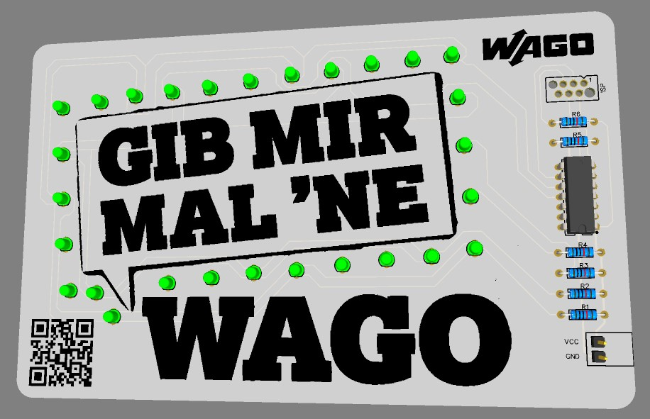

# Praktikum - Gib mir mal ’ne Wago

Bau einer "Gib mir mal ’ne WAGO" Platine zur Kampagne.

- Dauer: ~40 Min. (ohne Auf- und Abbbauzeit)

## Quick Links

- **Dokumentation:** [wago-enterprise-education.github.io/praktikum-gib-mir-mal-ne-wago/](https://wago-enterprise-education.github.io/praktikum-gib-mir-mal-ne-wago/)
- **Schaltplan:** [pcb/schematics_praktikum-lichtfolge.pdf](pcb/schematics_praktikum-lichtfolge.pdf)
- **Materialliste (BOM):** [bom.md](bom.md)
- **Ideen aus der Entwicklung:** [ideas.md](ideas.md)
- **TODO für V2.0** [TODO.md](TODO.md)

## Ansprechpartner

- [Andre Bell](mailto:andre.bell@wago.com)

## Handout

Das Handout ist inhaltlich aus der Datei `docs/index.md` erzeugt, wobei der Header getauscht wurde. Danach wird ein PDF in VS Code mit `Strg+P` -> Markdown Export PDF erzeugt. Das generierte PDF `handout.pdf` muss dann in den Ordner `docs` verschoben werden.
