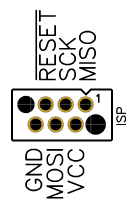

## Inhalt

1. [Sicherheitshinweise](#sicherheitshinweise)
1. [Bauteile](#bauteile)
1. [Bauanleitung](#bauanleitung)
1. [Upload des Programmcodes](#upload-des-programmcodes)
1. [Inbetriebnahme](#inbetriebnahme)
1. [Programming Guide](#programming-guide)
1. [Lust auf mehr?](#lust-auf-mehr)

Nach dem Bestücken und Einschalten der Platine läuft ein Lauflicht um die Sprechblase. Hör Dir doch gleich mal den Song 🎶 dazu an, den Du über den QR Code auf der Platine findest... &#x1F600;


{: .info}
Diese Anleitung gibt es auch als [Handout zum ausdrucken]().

<a id="sicherheitshinweise"></a>
## Sicherheitshinweise

- Bewahre diese Bedienungsanleitung für den späteren Gebrauch sicher auf! Sie enthält wichtige Informationen
- Der Bausatz ist lediglich für den Batteriebetrieb vorgesehen. Schließe den Bausatz niemals an 230 V Netzspannung an! Es besteht absolute Lebensgefahr!
- Beim Löten werden der Lötkolben, das Lötzinn und auch die Bauteile, die gelötet werden, sehr heiß. Sei deshalb besonders vorsichtig!
- Verwende beim Löten immer eine Lötunterlage! Das verhindert das Wegrutschen der Bauteile und der Platine.
- Um den Lötkolben während des Aufbaus sicher aufzubewahren, verwende einen Lötständer
- Die Platine kann andere Geräte elektromagnetisch beeinträchtigen oder von anderen Geräten beeinträchtigt werden.
- Betreibe die Platine nicht unbeaufsichtigt.

<a id="bauteile"></a>
## Bauteile

Anzahl | Artikel
-|-
28 | LED 3mm grün 2mA
1  | WAGO Picomax Stiftleiste 2091-1702
1  | WAGO Picomax Stecker 2091-1122
1  | Batteriehalter
4  | Widerstand $$33\Omega$$
2  | Widerstand $$10k\Omega$$
1  | Mikrocontroller ATTiny24A-PU

<a id="bauanleitung"></a>
## Bauanleitung

Gelötet wird bei THT-Bauteilen (Through Hole Technology, deutsch Durchsteckmontage) immer auf der Nicht-Bestückungsseite. Also muss die Platine nach dem Einsetzen einmal gedreht werden. Damit die Bauteile dabei nicht herausfallen, werden die Komponenten provisorisch fixiert werden. Hierzu steht Dir eine entsprechende Fixierung zur Verfügung, die wir mit dem 3D Drucker vorbereitet haben.


Da wir bleifreies Lötzinn verwenden, sollte der Lötkolben etwas höher eingestellt werden. **330 bis 360°C** sind ein guter Richtwert. Für Lötstellen, die mit einer großen Kupferfläche verbunden sind, beispielsweise GND-Flächen, können auch 380°C sinnvoll sein. Mit steigender Temperatur sinkt jedoch die aktive Dauer des Flussmittels im Lötzinn deutlich, was wiederum das Löten erschwert. Mehr als 380°C sollten nicht eingestellt werden, da dies die Lebensdauer der Lötspitze stark verringert.

Achte beim Löten darauf zunächst **das Lötpad auf der Platine und das Beinchen des entsprechenden Bauteils gleichzeitig zu erhitzen** und erst nach einigen Sekunden Lötzinn hinzuzugeben. Geduldig sein sorgt hier für bessere Ergebnisse. Halte anschließend den Lötkolben noch kurz an die Lötstelle bis das Lötzinn schön geflossen und das gesamte Lötpad bedeckt ist. Sollte das hinzugegebene Lötzinn nicht ausreichen, kann hier auch noch etwas nachgeführt werden.

Anschließend können mit einem Seitenschneider die überstehenden Drähte abgeknipst werden. Achte darauf dies nicht zu tief zu tun und **nur das Beinchen zu durchtrennen**, nicht die Lötstelle.

### Schritt 1

Als erstes werden die Widerstände $$R_1-R_6$$ bestückt. Dazu solltest Du die Drähte sehr nah am Widerstand abbiegen und dann durch die Bohrungen an den gekennzeichneten Stellen in die Platine stecken. Achte darauf die richtigen Widerstände zu verwenden! ($$R_1-R_4$$ sind $$33\Omega$$ Widerstände mit den Farben orange-orange-scharz-gold und $$R_5-R_6$$ sind $$10\text{k}\Omega$$ Widerstände mit den Farben braun-schwarz-schwarz-rot). Biege die Anschlussdrähte auf der Rückseite leicht zur Seite. Anschließend lötest Du die einzelnen Anschlussdrähte der Widerstände auf der Rückseite der Platine fest. Kürze die Bauteildrähte mit einem Seitenschneider vorsichtig oberhalb der Lötverbindung. Kürze immer nur einen Bauteildraht auf einmal!


### Schritt 2

Als zweites lötest du den Mikrocontroller ein. Das ist ein kleiner Computer, auf dem sich bereits ein Programm für das Lauflicht befindet. Achte darauf, dass sich die Gehäusekerbe an der gleichen Seite befindet, wie auf der Markierung der Platine. Löte alle 14 Anschlüsse auf der Rückseite fest.


### Schritt 3

Nun kommen die Leuchtdioden dran. Die Leuchtdioden haben einen etwas längeren Anschlussdraht. Diese Seite der Leuchtdiode „+“ muss immer in den oberen Kontakt auf der Platine gesteckt werden. Vorsicht, wenn die Leuchtdioden verkehrt herum eingelötet werden, dann funktioniert die Schaltung nicht!


Du kannst die Polarität auch nochmal von außen sehen. Der „Teller“ ist „-“ und muss immer **zur unteren Kante der Platine** ausgerichtet sein.
Genau wie bei den Widerständen hilft es, wenn Du die Anschlussdrähte vorsichtig leicht nach außen biegst. Kürze die Bauteildrähte nach dem einlöten mit einem Seitenschneider vorsichtig oberhalb der Lötverbindung. Kürze immer nur einen Bauteildraht auf einmal!

### Schritt 4

Stecke den WAGO picoMAX Steckverbinder und die Stiftleiste zusammen. Löte beide Stifte wie eingezeichnet unten rechts in die Platine ein. Nach dem Einlöten kann der Steckverbinder abgezogen und aufgesteckt werden. Um die beiden Leitungen des Batteriepacks anzuschließen, müssen die orangen Betätigungsdrücker mit einem kleinen Schraubendreher heruntergedrückt und gleichzeitig die entsprechende Leitung des Batteriepacks eingeführt werden. Verbinde die rote Leitung mit VCC und die schwarze Leitung mit GND.


<a id="upload-des-programmcodes"></a>
## Upload des Programmcodes

{: .info}
Der Programmcode ist als Arduino `ino` Datei im Github-Repository verfügbar. Am besten Du lädst die `gib_mir_mal_ne_wago.ino` Datei auf Deinen Rechner herunter. (Icon rechts oberhalb des Programmcodes `Download raw file`) [Programmcode herunterladen ➡️](https://github.com/wago-enterprise-education/praktikum-gib-mir-mal-ne-wago/tree/main/firmware)

Die Platine verwendet einen Mikrocontroller aus der [ATtinyx4A ↗️](https://ww1.microchip.com/downloads/en/DeviceDoc/ATtiny24A-44A-84A-DataSheet-DS40002269A.pdf){:target="_blank" rel="noopener"} Reihe. Konkret kommt hier ein **ATtiny24A** zum Einsatz. Die Mikrocontrollerreihe verfügt über einen internen Oszillator für den Prozessortakt und kann über ein sogenanntes ISP-Interface programmiert werden. Der Eingangsspannungsbereich beträgt 1,8 bis 5,5 V.

Programmieren kann man den Mikrocontroller beispielsweise über die MPLAB® X IDE von Microchip, aber auch über Tools wie avrdude oder Arduino.

Bei unseren Praktikumsmodulen verwenden wir die [Arduino IDE ↗️](https://www.arduino.cc/en/software/){:target="_blank" rel="noopener"}. Dabei handelt es sich um eine open source Entwicklungsumgebung mit einer großen und aktiven online Community mit vielen Ressourcen zum Lernen. Über den darin integrierten Boards Manager kann der [ATTinyCore ↗️](https://github.com/SpenceKonde/ATTinyCore){:target="_blank" rel="noopener"} installiert werden, der es ermöglicht AVR-basierte Mikrocontroller wie den ATtiny24A zu programmieren.

Dafür wird ein zusätzliches Gerät, ein **ISP-Programmer**, benötigt. Es kann jedoch auch beispielsweise ein Arduino Uno hierfür verwendet werden. Hier findest du eine Anleitung dazu: [Programming ATtiny with Arduino code ↗️](https://wolles-elektronikkiste.de/en/programming-attiny-with-arduino-code){:target="_blank" rel="noopener"}. Die entsprechenden ISP-Verbindungen sind auf der Platine als Lötkontakte ausgeführt, an die du übergangsweise Kabel anlöten kannst. Im folgenden Bild kannst Du sehen, wie der Anschluss belegt ist:



Für eine schnelle und unkomplizierte Programmierung wurde im WAGO Ausbildungsbereich zusätzlich ein [ISP UPDI Programmer](https://wago-enterprise-education.github.io/isp-updi-programmer/) als Aufsatz für einen Arduino Uno entwickelt. Über lötfreie Steckverbinder kann hiermit der Mikrocontroller auf der Platine programmiert werden.


{: .info}
**ACHTUNG** Bei dieser Platine muss die Programmierung **ohne** Batterien erfolgen!!!

### Kurzanleitung

1. Falls nicht schon geschehen: AurduinoISP Sketch `File > Examples > 11.ArduinoISP > Arduino ISP` auf den Arduino Uno, Leonardo oder Mega laden. Beim WAGO ISP UPDI Programmer muss eventuell der linke Jumper entfernt werden.
2. Arduino Projekt ([praktikum-gib-mir-mal-ne-wago](https://github.com/wago-enterprise-education/praktikum-gib-mir-mal-ne-wago/tree/main/firmware)) öffnen
3. Mikrocontroller auswählen `Tools > Board: … > ATTinyCore > ATtiny24/44/84(a) (No bootloader)`
4. Standardeinstellungen können bestehen bleiben (vgl. Abb.)
5. `Tools > Programmer > Arduino as ISP` auswählen
6. `Tools > Port` und den COM-Port auswählen mit dem der Arduino verbunden ist
7. `Tools > Burn Bootloader` ausführen (muss bei Änderung der Clock Source erneut durchgeführt werden)
8. Upload (Pfeil oben links)


<a id="inbetriebnahme"></a>
## Inbetriebnahme

Zuletzt musst Du die Batterien in das Batteriepack einlegen. Nutze hierzu einen kleinen Kreuzschraubendreher und öffne das Batteriepack. Achte auf die Richtung der Batterien! Schließe und verschraube das Batteriepack wieder. Die Platine ist nun betriebsbereit.


<a id="programming-guide"></a>
## Programming Guide

In diesem Kapitel gibt es eine kurze Einführung dazu, wie du **den Programmcode für die Platine ändern** kannst. Grundlagen für das Programmieren in C++ (Arduino) werden dabei vorausgesetzt. Bei YouTube gibt es ansonsten viele einsteigerfreundliche Tutorials dazu, suche einfach nach *Arduino Tutorial* und schon nach kurzer Zeit solltest du in der Lage sein die LEDs nach deinen Vorgaben anzusteuern.

### Programmcode

In der Funktion `setup()` werden zunächst die vier Pins, an denen sich die LEDs befinden, als Ausgänge defininert. Die Routine `loop()` wird danach immer wieder ausgeführt. Hier kannst Du sehen, dass der Programmcode im wesentlichen aus vier sehr ähnlichen Blöcken besteht. In einem Block werden alle Ausgänge auf `HIGH` (LEDs sind dann aus) gesetzt. Einer der Ausgänge wird auf `LOW` gesetzt (LEDs sind an). Danach wird mit einem `delay(100)` für $$100ms$$ also $$0,1s$$ gewartet.

{:.info}
Den Schaltplan der Platine, um zu sehen welche Pins des Mikrocontrollers womit verbunden sind, findest du hier: **[Schaltplan Praktikum – Gib mir mal ’ne WAGO ➡️](https://github.com/wago-enterprise-education/praktikum-gib-mir-mal-ne-wago/blob/main/pcb/SCH_praktikum-gib-mir-mal-ne-wago.pdf)**

### Basisprogramm

```C++
uint8_t leds[] = {PIN_PA3, PIN_PA2, PIN_PA1, PIN_PA0};

void setup() {
  // Set pins D0-D3 as outputs
  for (int pin = 0; pin <= 3; pin++) {
    pinMode(leds[pin], OUTPUT);
  }
}

void loop() {
  // Muster 1: 0b00000111 -> D0, D1, D2 HIGH, D3 LOW
  digitalWrite(0, HIGH);
  digitalWrite(1, HIGH);
  digitalWrite(2, HIGH);
  digitalWrite(3, LOW);
  delay(100);

  // Muster 2: 0b00001011 -> D0, D1, D3 HIGH, D2 LOW
  digitalWrite(0, HIGH);
  digitalWrite(1, HIGH);
  digitalWrite(2, LOW);
  digitalWrite(3, HIGH);
  delay(100);

  // Muster 3: 0b00001101 -> D0, D2, D3 HIGH, D1 LOW
  digitalWrite(0, HIGH);
  digitalWrite(1, LOW);
  digitalWrite(2, HIGH);
  digitalWrite(3, HIGH);
  delay(100);

  // Muster 4: 0b00001110 -> D1, D2, D3 HIGH, D0 LOW
  digitalWrite(0, LOW);
  digitalWrite(1, HIGH);
  digitalWrite(2, HIGH);
  digitalWrite(3, HIGH);
  delay(100);
}
```

<a id="lust-auf-mehr"></a>
## Lust auf mehr?

Falls Du Lust auf mehr Technik hast, oder WAGO noch besser kennenlernen möchtest, dann mach doch ein Praktikum oder eine Ausbildung bei uns...

Schau doch einfach mal auf unserer [Karriereseite](https://www.wago.com/de/ausbildung-studium) vorbei!


